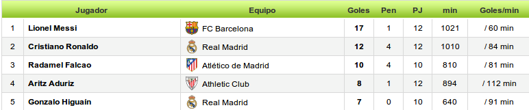

# Ejercicios sobre jQuery y eventos

1. Al poner el ratón encima de los párrafos tiene que cambiar su color a rojo. Al salir el ratón del párrafo, debe volver a negro. Si hacemos clic sobre el primer párrafo se debe ejecutar la función clicAlerta(). Asocia los eventos con los elemento mediante el método on().

  Algunas preguntas...

  - ¿Qué eventos podrías utilizar para hacer la primera parte del ejercicio?

  - ¿Presenta algún comportamiento análogo el ejercicio? ¿Se te ocurre como podrías solucionarlo?

2. Al pulsar sobre el botón eliminaremos el evento clic del primer párrafo. Utiliza el método off() para resolver el ejercicio.

3. Demuestra mediante el código de ejercicio3.html el comportamiento que tienen los eventos:
  - hover()
  - mouseenter() y mouseleave()
  - mouseover() y mouseout()

4. Crea un formulario con una caja de texto donde se introduzcan elementos para la cesta de la compra. Cada elemento que se añada mediante el formulario se añadirá en una lista en la propia página web. Los elementos de la lista sobre los que se haga clic se deberán marcar con algún efecto: negrita, subrayado, etc. 

5. Crea una tabla  con los máximos goleadores de la liga de futbol española. La cabecera estará compuesta de Nombre Jugador, Club y número de goles. Cuando nos pongamos encima de cada uno deberá aparecer un pequeño tooltip que muestre los goles que ha marcado de penalty, los partidos y minutos jugados y los goles/min.
