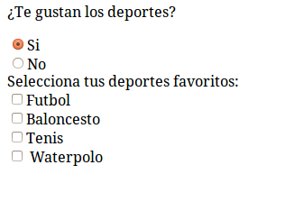

# Ejercicios sobre jQuery, selectores, html y css

1. Rellena la caja de texto del ejercicio1.html para que se seleccionen:
  - Todas las negritas o cursivas del documento
  - Los textos verdes o rojos 
  - Los textos rojos con fondo gris
  - El cuarto párrafo

2. Rellena los selectores jquery del fichero ejercicio2.html para que el aspecto de la página web sea como el de la imagen ejercicio2.png. No se deben añadir estilos ni modificar el html.

3. Abre el fichero ejercicio3.html. Al dar a cada enlace se debe cambiar el color de fondo de la capa. Al poner el ratón sobre la capa, la capa se debe mover 10px hacia la derecha.

4. Crea un formulario como el siguiente, y que se comporte de modo que:
  - Si pulsamos en si, los deportes están habilitados para marcar. Si pulsamos en no, están deshabilitados.
  - Cada vez que pulsamos en Si/No, se resetean los deportes que se hubieran marcado previamente.
  

5. Añade el jQuery/css que consideres necesario para que las filas impares tengan diferente aspecto (“zebra tables”) a las filas pares, con independencia del número de registros que tenga la tabla.

6. Inicializa el formulario del ejercicio4 para que por defecto aparezca marcado que si gustan los deportes, y que sus deportes favoritos son Baloncesto, Tenis y Waterpolo. Debes hacerlo directamente mediante jQuery (simulando que la inicialización del formulario pudiera venir de una lectura previa de la bbdd).

  *Ayuda: Puedes utilizar el método val()*

7. Completa el código del ejercicio7.html, de manera similar al ejercicio 6, para que el comportamiento del formulario sea dinámico (el contenido del textarea debe variar en función del select). 