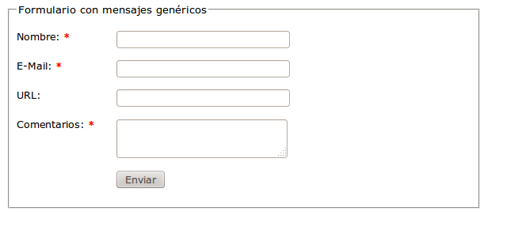

# Ejercicios de jQuery – plugin Validation – Primeros pasos

1. Crea un formulario como el siguiente:
  
  Comprueba la validación de campos propia del navegador y desactívala posteriormente.

2. Dado el formulario anterior, utiliza el plugin de validación mediante el uso de metadatos para que los campos cumplan las siguientes condiciones:
  - Nombre: requerido y con al menos dos caracteres.
  - Email: requerido, un correo electrónico válido.
  - Url: Una url válida o vacío.
  - Comentarios: requerido.

3. Modifica el ejercicio anterior para que la validación se produzca exclusivamente al hacer el envío del formulario.

4. Implementa en el ejercicio anterior la validación usando el objeto rules en vez de los metadatos.

5. Modifica los avisos de error para que figuren en rojo y con letra pequeña.

6. Cambia la posición del mensaje de aviso a la izquierda de cada caja de texto en vez de a su derecha.

7. Cambia los mensajes de error para que aparezcan en la parte superior del formulario, todos juntos como si fuera una lista.

**Nota**: Además de la carpeta de soluciones aquí presente, donde se han resuelto los ejercicios de forma "tradicional", puedes intentar resolverlo utilizando un entorno YEOMAN. Puedes ver esta solución en [este repositorio](https://github.com/juanda99/validacion) 
  

  
